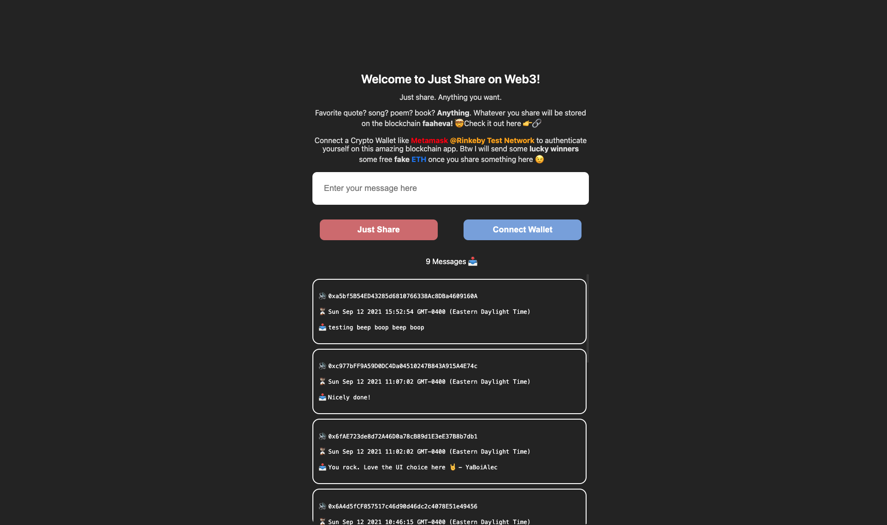

# **Just Share**

## 📝 **Web3 App with Solidity + Ethereum Smart Contracts + Next.js + Vercel**

Build & deploy a smart contract to the blockchain, and build a Web3 client app to interact with the smart contract.

A portal on web3 where anyone on the internet can interact with the web3 app and share something with you like a message, song, books, etc. The data is stored on the blockchain and is encrypted through an Ethereum smart contract.

*`A smart contract is basically a code that lives on the blockchain you can read and write from`*

The website will also let people connect their crypto wallets and interact with the smart contract.

---
## 🛠 **Technologies Used**

1. **Solidity**: A smart contract language that runs on the Ethereum blockchain.
2. **Hardhat**: A tool that let's us easily deploy a local Ethereum network and give us fake ETH and fake test accounts to work with. It's just like a local server, except the server is the blockchain.
3. **Next.js**: A framework for building web apps that uses React.
4. **Vercel**: A hosting service that lets us deploy our app to the internet.
5. **Metamask**: A browser extension that lets us interact with the blockchain.
6. **Alchemy**: A tool that helps us broadcast our contract creation transaction so that it can be picked up by the miners as quickly as possible. Once the transaction is mined, it is then broadcasted to the blockchain as a legit transaction. From there, everyone updates their copy of the blockchain.
7. **Testnet**: A tetstnet that is used to test our smart contract. It's a separate network from the main network. Main network is used for the real world, which is costly. We use `Rinkeby` testnet for our development. 
8. **Faucet**: A service that gives free fake ETH to users.

## 🔗 **Live App**

[](https://justshare.vercel.app)


---
## Getting Started

First, run the development server:

```bash
npm run dev
# or
yarn dev
```

Open [http://localhost:3000](http://localhost:3000) with your browser to see the result.
